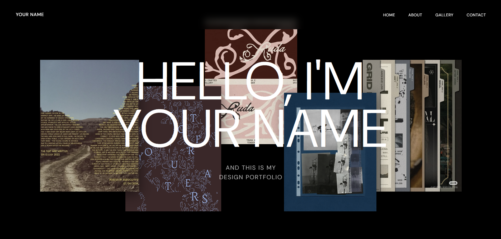
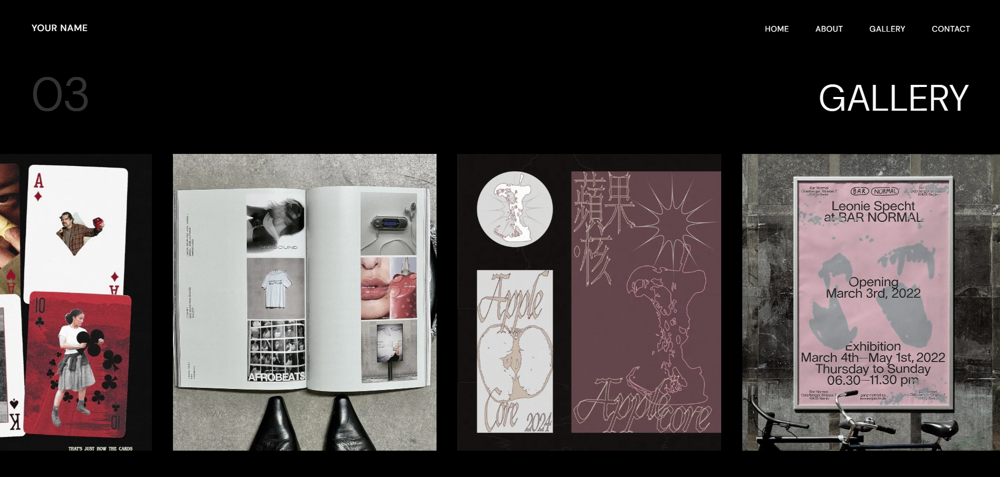
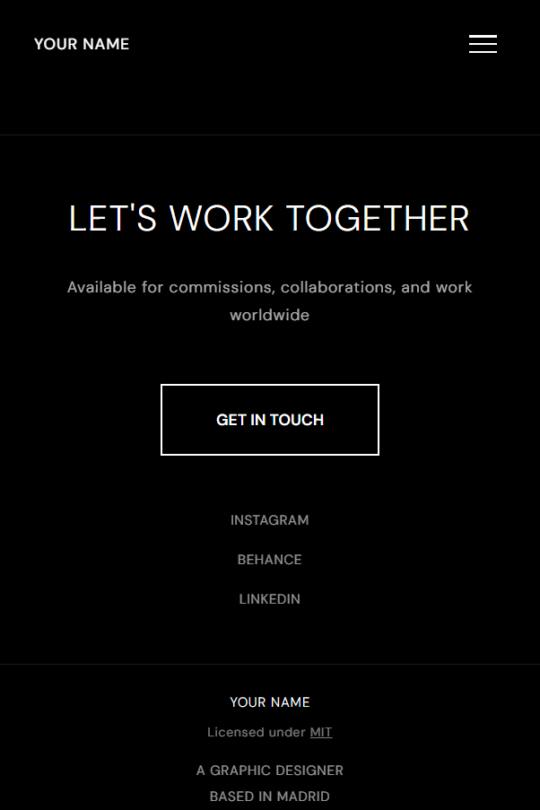

# my portfolio Website

You can find the deployment site in here: [https://luciaantonb.github.io/Portfolio-template-AntonLucia/]

## Project Description and Purpose

This project is a customizable portfolio website template designed for creatives, designers, and developers who want a clean, modern, and animated online presence.
The goal of the project is to provide a flexible starting point that combines a structured layout with expressive motion, allowing users to easily adapt the design to their own identity.

The template is built on top of an existing Bootstrap layout, which has been heavily customized in terms of layout, typography, color system, and interaction design. GSAP animations are used to enhance the user experience through smooth transitions, scroll-based motion, and subtle micro-interactions without compromising performance or accessibility.

This project is intended both as a personal portfolio solution and as a reusable template that can be adapted for different creative profiles.

## Tech Stack Used

- HTML5 – Semantic structure and content organization
- CSS3 / SCSS – Custom styling and layout overrides on top of Bootstrap
- Bootstrap 5 – Responsive grid system and base UI components
- JavaScript (ES6) – Interactive behavior and logic
- GSAP – Page transitions, scroll animations, and UI motion
- GSAP ScrollTrigger – Scroll-based animation control
- Git & GitHub – Version control and project management

## Setup Instructions for Local Development

1. Clone the repository
2. Navigate to the project folder
3. Open the project locally
4. Start editing: HTML files for content and structure, CSS files for styling, JavaScript files for animations and interactions

No build step is required unless you choose to add one.

## Customization Guide

Content

- Update text, project data, and images directly in the HTML files
- Replace placeholder images inside the /images folder or linking them via imagekit.io

Styling

- Customize colors, fonts, and spacing in the main CSS/SCSS files
- Bootstrap utility classes can be overridden for a more custom look

Animations

- GSAP animations are located in the main JavaScript files
- You can adjust timing, easing, triggers, and animation sequences to better match your personal style
- Scroll-based animations are handled using GSAP ScrollTrigger

Layout

- The Bootstrap grid system makes it easy to add, remove, or rearrange sections.
- Sections can be duplicated or removed depending on portfolio needs.

## Screenshots or Demo GIF

Homepage

Scroll Animations

Responsive Layout

## Credits and Acknowledgments

- Bootstrap – For the responsive framework and base components
- GSAP – For powerful and performant web animations
- Original Bootstrap Template – Used as a structural starting point and heavily customized
- Google Fonts – Typography resources
- Open-source community – For documentation, tutorials, and inspiration
- Claude.ai – AI-assisted support for code modifications and template customization
